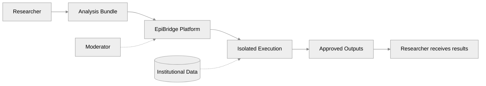
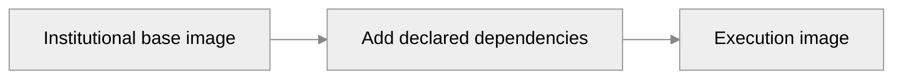
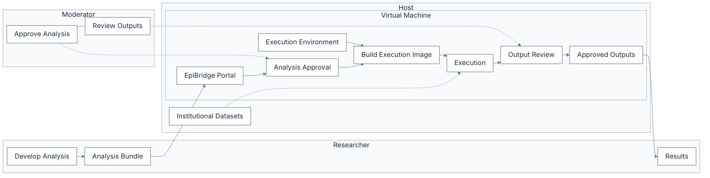

<style>
.slidev-layout p {
  opacity: 1 !important;
  color: inherit !important;
}
</style>

# EpiBridge
## Supporting collaborative research on sensitive datasets

**Kraemer Lab, University of Oxford**

---

# A Familiar Problem

<span />

A public health institute holds sensitive patient data.

A collaborator at another institution has developed an analysis that could advance the research.

How can they work together without moving the data?

---

# How Research Happens Today

- **Move the data** — risky, may violate consent or regulation
- **Build a Trusted Research Environment** — secure, but expensive and slow to stand up
- **Don't collaborate** — the safest option, but the worst for science

EpiBridge offers a fourth option.

---

# Code Moves to the Data

<span />

**The data never leaves the institution.**

The analysis travels to the data — not the other way around.

Execution happens inside the institution's own environment.

Only the results leave, after institutional review.

---

# Locally Deployable

<span />

EpiBridge runs on a single institutional machine.

No cloud infrastructure required. No data centre needed. One server.

**Who is it for?**
- Any institution with sensitive data
- Labs collaborating across sites
- Organisations wanting governance without large infrastructure

---

# Governance Without Complexity

<span />

Three distinct responsibilities:

- **Researcher** — writes and submits analyses
- **Moderator** — reviews analyses and approves outputs before release
- **Institution** — controls the data, defines the environment, owns the governance

No roles beyond what a small team needs.

Every step is recorded in the audit ledger. No step bypasses institutional governance.

---

# Architecture Overview



The platform sits between the researcher and the data.

The researcher never accesses the data directly.

The moderator governs every transition.

---

# Analysis Bundle

<span />

An **Analysis Bundle** is an immutable description of an analysis.

It contains everything needed to reproduce the computation:

- **Code** — the analysis script
- **Dependencies** — required packages or libraries
- **Metadata** — entrypoint, interpreter, resource declarations

```text
analysis.zip
├── run.py
├── requirements.txt
└── README.md
```

The bundle is submitted for review. It cannot be modified after submission.

---

# Building the Execution Environment

<span />

When an analysis is approved, the platform:

1. Reads the declared dependencies
2. Selects the institutional base environment
3. Builds a dedicated execution image containing the analysis and its dependencies



Once built, the environment is cached. Identical dependencies produce identical images — no rebuild needed.

---

# Under the Hood



---

# Why EpiBridge?

<span />

**The core idea:** Code moves to the data. The data never leaves the institution.

**For researchers:** Use your own tools — R, Python, Stata. Work in your usual environment. Get results after institutional review.

**For institutions:** Retain full control. Every step is audited. One machine, no cloud required.

**For collaboration:** Secure, governed, reproducible — without moving sensitive data.

---

# EpiBridge

<span />

**Project Repository**

<https://github.com/kraemer-lab/EpiBridge>

Source code, documentation, and issue tracking.
