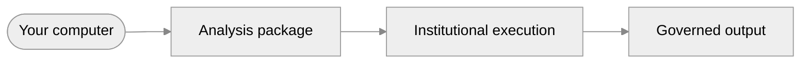
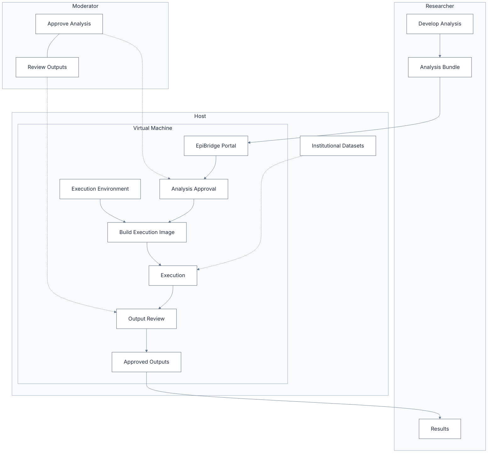
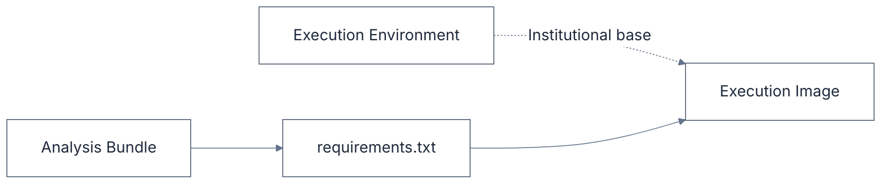

<style>
.slidev-layout p {
  opacity: 1 !important;
  color: inherit !important;
}
</style>

# EpiBridge
## Supporting collaborative research on sensitive datasets

**Kraemer Lab, University of Oxford**

---

# The Problem

<span />

Your research group holds sensitive data.

Your need collaborators to work with it — but you cannot simply send them the data

How do you enable analysis while maintaining control?

---

# How Research Happens Today

<span />

Large institutions provision **Trusted Research Environments (TREs)**: secure facilities where researchers access data through remote desktops and notebooks

TREs provide strong governance but require substantial infrastructure

Many labs and smaller institutions hold governed data but lack large research computing facilities

---

# EpiBridge: Locally Deployable



EpiBridge is a deployable platform that runs on a single machine — no data centre required.

Institutions install it locally and immediately gain a governed execution pipeline for sensitive data.

---

# What This Means

<span />

**For researchers:**
- Prepare analyses in your usual environment
- Submit analyses
- Receive results

**For institutions:**
- Governed data stays in your control
- Every execution is audited
- Outputs are reviewed before release

---

# Who Is It For

<span />

Any institution with sensitive data

Labs collaborating across sites

Organisations wanting governance without large infrastructure

EpiBridge can run on a single computer

---

<div style="max-width:60%;margin:auto">



</div>

---

# From the Researcher's Side

- Inspect the institution's data schema, sample datasets and execution environment
- Write your analysis in R, Python, Stata — your usual tools
- Specify environment execution requirements
- Package and submit as an Analysis Bundle
- Wait for institutional approval / execution
- Download results when released

You never access the governed data directly

---

# From the Moderator's Side

- Review incoming Analysis Bundles
- Approve or reject submissions
- Monitor execution
- Review output results
- Release approved outputs

The institution governs every step

---

# Analysis Bundle

<span />

An Analysis Bundle is an **immutable description of an analysis**.

Typical contents for a Python-based analysis:

```text
analysis.zip
├── run.py
├── requirements.txt
└── README.md
```

Typical contents for a Conda-based analysis:
```text
analysis.zip
├── run.sh
├── environment.yml
└── README.md
```

---

# Building the Execution Image

<div style="width: 65%; margin:auto;">



</div>

### Institutional Build

The platform uses a curated builder template.

```
FROM ${BASE_IMAGE}

COPY requirements.txt .

RUN pip install ...
```

Only the dependency specification influences the image

Once built, the environment can be reused

---

# Why this matters

<span />

Researchers describe:

- **what** should be executed
- **which** dependencies are required
- optionally **how** the image should be extended

The institution remains responsible for:

- the execution environment
- execution
- governance
- release

This separation preserves reproducibility while allowing controlled flexibility

---

# EpiBridge

<span />

**Project Repository**

<https://github.com/kraemer-lab/EpiBridge>

Source code, documentation, and issue tracking.
